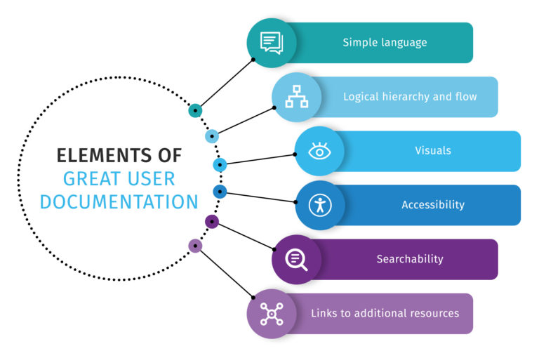

# Writing good documentation

### Simple Language
When it comes to any form of technical writing, perhaps the most important thing is the simplicity of language.

This is especially true for documentation targeted at end-users, who don’t have much technical knowledge. 

Even the most advanced features should be broken down in the simplest way possible to effectively explain its functionality and how to get the most out of it.

### A Good Flow
The second most crucial element of all successful user documentation is having a logical flow (or outline, if you will).

The goal is to deliver a coherent experience to your users in a way that makes sense, by solving one problem at a time.

For instance, if you’re selling an enterprise software, you wouldn’t want to start with the advanced features right off the bat.

Instead, you’d want to start off by helping them get set up, break down the user interface, and then take them through the individual features and what they can accomplish with them.

### Use of Visuals
The best user documentation has visuals.

Visuals can help simplify a complicated process and make it easier to understand. To that end, in addition to written instructions of a process, it’s highly recommended that you also show the users how it’s down.

Examples of visuals can include illustrations, screenshots, GIFs, or even short videos.

